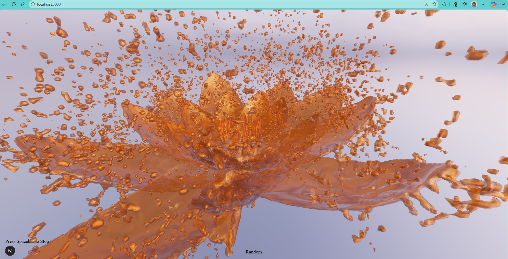
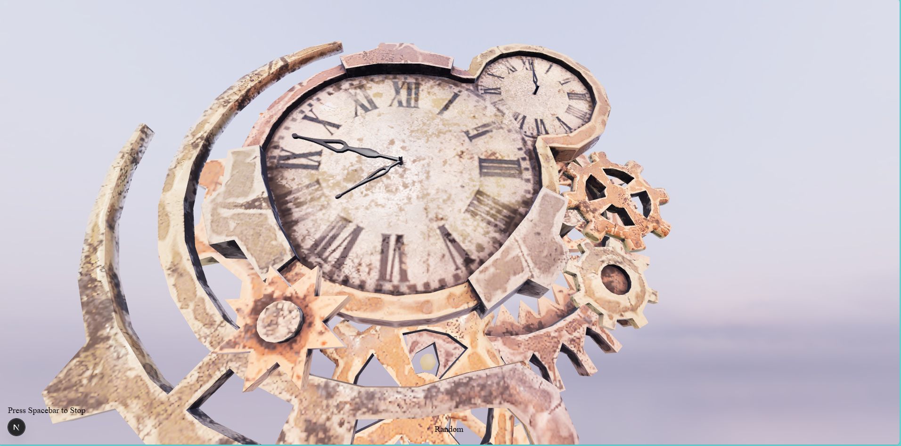

# 3D Model Viewer (Web)

This project is a web-based 3D avatar viewer built with React Three Fiber and Three.js that loads and displays interactive `.glb` models in a browser environment with lighting, background, and camera controls. It allows users to dynamically switch models, view them in a physically grounded scene, and interact through zoom, rotation, and keyboard-triggered behaviors.           

Press the ```spacebar``` to stop the model from rotating. 
If the model is out of sight, reload the page.



## Project Setup

After cloning the project, go to the ```web-avatar-viewer``` folder and run the following commands in the terminal:

```
npx create-next-app@latest web-avatar-viewer
cd web-avatar-viewer
npm install three @react-three/fiber @react-three/drei three-stdlib
npm install zustand
```

Running the project: ```npm run dev```

---



## Models Credit (Sketchfab & Poly Haven)

Sky Background: [Qwantani Dusk 2 (Pure Sky)](https://polyhaven.com/a/qwantani_dusk_2_puresky)

```
"Blue Flower Animated" (https://skfb.ly/oDIqT) by morphy.vision is licensed under Creative Commons Attribution (http://creativecommons.org/licenses/by/4.0/).

"S**t happens" (https://skfb.ly/6RqNV) by Loïc Norgeot is licensed under Creative Commons Attribution (http://creativecommons.org/licenses/by/4.0/).

"Guitar" (https://skfb.ly/6wG8w) by Ivan Dnistrian is licensed under Creative Commons Attribution (http://creativecommons.org/licenses/by/4.0/).

"Birds" (https://sketchfab.com/3d-models/birds-3a9bb97be78944f9bffc23fb25c2154e) by Zacxophone

"Broken Steampunk Clock" (https://skfb.ly/6T9V7) by VassKacsoHunor is licensed under Creative Commons Attribution (http://creativecommons.org/licenses/by/4.0/).

"Flowers (Lowpoly)" (https://skfb.ly/pyJMy) by Vertex is licensed under Creative Commons Attribution (http://creativecommons.org/licenses/by/4.0/).

"Flower" (https://skfb.ly/6TGKv) by olilar is licensed under Creative Commons Attribution (http://creativecommons.org/licenses/by/4.0/).
```

---
Music by <a href="https://pixabay.com/users/everything_is_dead-54651617/?utm_source=link-attribution&utm_medium=referral&utm_campaign=music&utm_content=511240">everything_is_dead</a> from <a href="https://pixabay.com//?utm_source=link-attribution&utm_medium=referral&utm_campaign=music&utm_content=511240">Pixabay</a>

---

### Project Features

* Random ```.glb``` model switching
* Camera controls (zoom, orbit)
* Auto-rotation + spacebar pause
* Environment lighting + background
* UI (Random + instruction text)
* Background music
